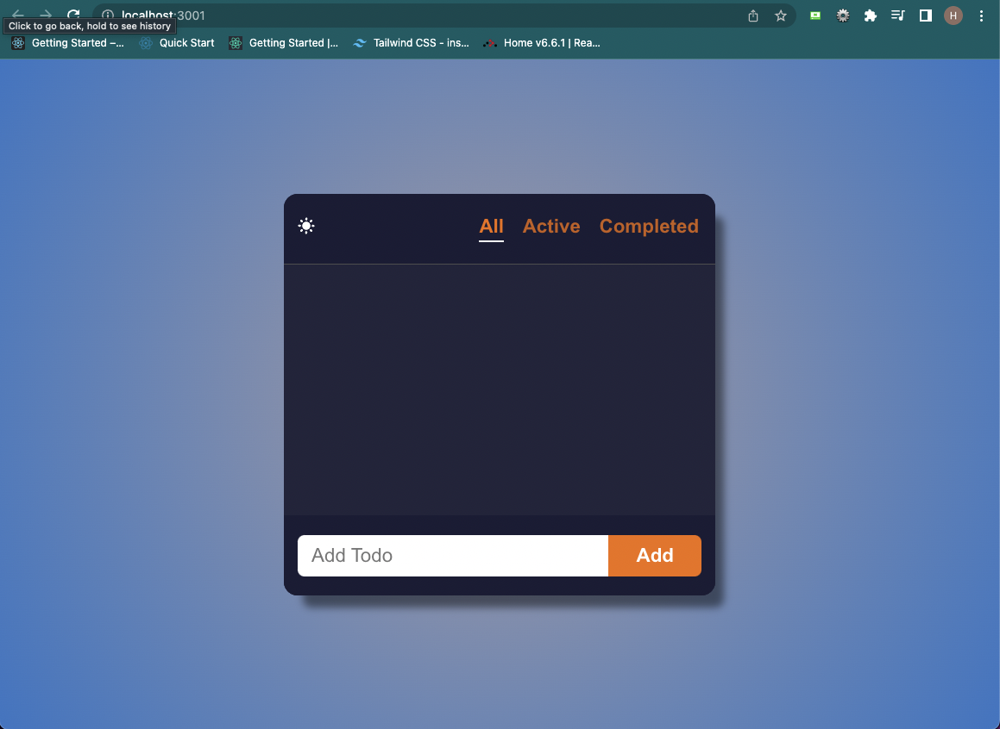
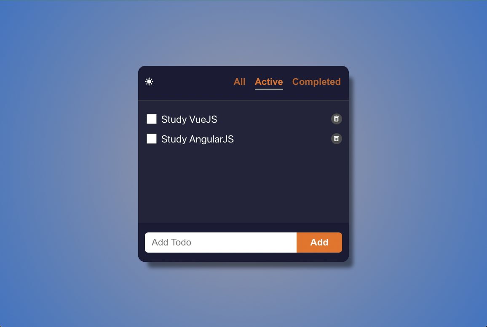

## My TODO Project (with React)
    In this project, I made a TODO List using React, one of the Javascript libraries.
       
    command: yarn start
    
    < Runs the app in the development mode >
      - terminal command : yarn start
    
    < Deploy link >
      - https://mytodolist0784.netlify.app/
      
    < My TODO Feautres >
      1. All, Active, and Completed filters.
      2. Data is saved, even if the page is refreshed.
      3. DarkMode
      4. Four basic operations such as CRUD is working.

`Figure 1 : The first screen when the program is executed or the deployed address link is clicked.`

 

`Figure 2: When my Todo list is added.`
 
`Figure 3: When one of my Todo list is completed (clicked).`
 
`Figure 4: "Study React" in Active state is not displayed, but in Completed it appears (It is shown in Figure 5).`
 
`Figure 5:`
 

    Deleting is executed, when the user clicks the trash bin icon.

`Figure 6: After "Study React" list is deleted in All.`
 

`Figure 7: After "Study React" list is deleted in Completed. `
 

`Figure 8: After the user click the sun icon button.`
 
